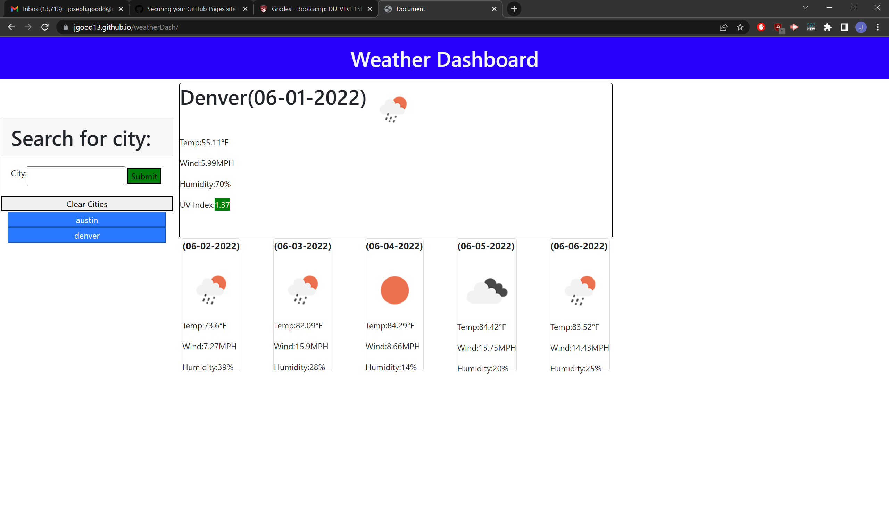

# weatherDash

## Website Description

I created a website that utilizes the openweatherapi to search for a cities current weather including UV index, windspeed, current temperature. As well as showing the next 5 days weather on seperate cards. You are also able to click on the saved past searches to search them again, you can also clear that at any point by clicking on clear cities button.

The most difficult part for me was to get localStorage to not create a second button for the city when searched for twice. 

## Features

1. Will search for any city and display todays weather
2. Will save any searched cities
3. You can click on saved cities to go back to them
4. Can clear saved cities with clear button
5. Will show weather of next 5 days as well

## Link to page
<a href = "https://jgood13.github.io/weatherDash/"
target="_blank"> Deployed Webpage </a>

## Screenshot

